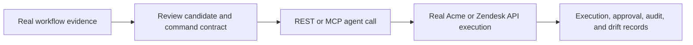

# VerblLayer

**Turn real business workflows into reviewed, agent-callable commands.**

VerblLayer is an open-source, self-hosted command layer for existing business software. It accepts real workflow evidence, helps an operator turn that evidence into a reviewed command contract, and exposes the command to AI agents through REST and MCP. Every execution, approval, drift check, and audit event is persisted.

It is not a chatbot, generic knowledge base, RPA clone, or simulated demo.

## Why it exists

Agents need a safe way to act in business software. Raw APIs are often too low-level; opaque automation is too hard to review. VerblLayer sits between them: it makes a workflow explicit, validates inputs, enforces approvals, calls a real target, and retains the evidence needed to understand what happened.

## How it works



1. Register a real target application.
2. Upload SOPs, CSV exports, traces, or process text.
3. Discover workflow candidates with a configured model provider.
4. Review a candidate, define the API route and method, then publish a command version.
5. Let an agent call the command through REST or MCP.
6. Inspect persisted executions, approvals, audits, and route-level drift checks.

## What is supported today

| Capability | Status | Boundary |
| --- | --- | --- |
| Controlled Acme Support Admin | Implemented | Real PostgreSQL state and refund execution; fresh Docker-backed release proof is still required in this checkout. |
| Zendesk ticket update | Implemented | `PUT /api/v2/tickets/{ticket_id}.json`; only server environment-variable names are stored. Live credential proof is pending. |
| Workflow discovery | Available when configured | Uses OpenAI, Anthropic, or OpenRouter. Missing credentials return an unavailable state. |
| REST, MCP, and OpenAPI | Implemented | API-key scoped, persisted agent access. |
| Approvals, command versions, audit, and drift | Implemented | Commands are reviewed, versioned, and safety-paused after repeated real failures. |
| Other SaaS execution targets | Unavailable | VerblLayer does not imply connector support that has not been built and verified. |

See [docs/CAPABILITIES.md](docs/CAPABILITIES.md) for the complete capability ledger.

## Quick start

### Prerequisites

- Node.js 20
- pnpm 10
- Docker Desktop with virtualization enabled

```powershell
pnpm install
Copy-Item .env.example .env
pnpm db:up
pnpm prisma:migrate:deploy
pnpm prisma:seed
pnpm dev
```

Open `http://localhost:3100`. Local development uses the persisted seeded operator only when `DEV_AUTH_ENABLED=true`.

To prove the complete local path:

```powershell
pnpm verify
```

## Production deployment

Build and run the production server with `pnpm build` and `pnpm start`. Do not expose local development authentication publicly.

Production requires a trusted identity proxy and these environment settings:

```text
AUTH_MODE=trusted_proxy
DEV_AUTH_ENABLED=false
TRUSTED_AUTH_PROXY_SECRET=<32+ character secret>
```

The proxy must remove every client-provided `x-verblayer-*` header, authenticate the request, then inject:

```text
x-verblayer-auth-secret
x-verblayer-org
x-verblayer-email
```

VerblLayer checks the shared secret, resolves the email and organisation to an existing user, and uses only the persisted role for authorisation. Keep API keys, provider keys, Zendesk credentials, and database credentials server-side. Put a rate-limiting reverse proxy or equivalent edge layer in front of a public deployment.

## Agent access

Create a scoped API key at `/mcp-api`, then inspect the real command inventory before calling anything:

```powershell
$headers = @{ Authorization = "Bearer <api_key>"; "Content-Type" = "application/json" }
Invoke-WebRequest -Method Post -Uri "http://localhost:3100/api/mcp" -Headers $headers -Body '{"tool":"list_commands","args":{}}'
Invoke-WebRequest -Method Get -Uri "http://localhost:3100/api/v1/openapi"
```

Use the returned input schema and command name for any subsequent call. VerblLayer does not provide a fabricated example command.

## Safety model

- Commands require explicit API routes and reviewed HTTP methods before publication.
- Inputs are validated server-side; high-risk amount thresholds can require persisted approval.
- Every publish creates an immutable command version.
- Executions carry real results or real errors. Dry runs do not call the target.
- Three consecutive non-dry-run failures pause a published command and create an audit event.
- Drift checks validate route reachability against the command's registered target.

## Current limits

- No hosted login, SSO/SCIM, user provisioning, or generic connector framework.
- Zendesk supports ticket updates only; OAuth and browser execution are out of scope.
- Drift checks are route-level, not semantic contract validation.
- The in-process limiter is suitable for a single instance; use an edge gateway for multi-instance rate limiting.

## Contributing and security

Read [CONTRIBUTING.md](CONTRIBUTING.md), [CODE_OF_CONDUCT.md](CODE_OF_CONDUCT.md), [SUPPORT.md](SUPPORT.md), and [SECURITY.md](SECURITY.md) before participating. Contributions must preserve the real, reviewable command path—no mock execution, discovery, audit, metric, or drift behaviour.

## Release status

This repository is preparing for its first public `v0.1.0-beta` release. Before publication, maintainers must apply and verify migrations on a fresh database, run CI on the public remote, configure a private security contact, and complete live Zendesk sandbox proof or retain its pending-verification label.

## License

[MIT](LICENSE)
