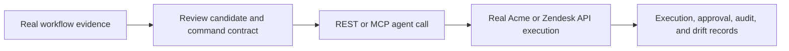

# Open-source Publication Implementation Plan

> **For agentic workers:** REQUIRED SUB-SKILL: Use superpowers:executing-plans to implement this plan task-by-task. Steps use checkbox (`- [ ]`) syntax for tracking.

**Goal:** Make the repository truthfully ready for a public `v0.1.0-beta` release: reproducible CI, clear security and contribution expectations, and a contributor-first README.

**Architecture:** Keep verification intentionally narrow. A CI-only script targets the GitHub Actions Postgres service without starting Docker Compose; local `pnpm verify` remains the full Docker-backed gate. Public documentation describes only current, provable behavior and makes the trusted-proxy deployment boundary explicit.

**Tech Stack:** GitHub Actions, pnpm, PostgreSQL 16, Next.js, Prisma, Vitest, Playwright, Markdown.

## Global Constraints

- Do not add Redis, queues, OAuth, browser fallback, mock integrations, fake badges, screenshots, statistics, or customer claims.
- CI uses the existing lockfile and Postgres service; it never relies on the local Docker Compose port.
- No secrets, tokens, or database credentials beyond disposable CI/local test values appear in committed files.
- Public docs distinguish verified behavior from environment-blocked proof.
- Keep local `pnpm verify` as the Docker-backed operator command; use a separate `pnpm verify:ci` command for Actions.

---

### Task 1: Replace the stale CI contract with a Postgres-only gate

**Files:**
- Create: `tests/unit/publication-files.test.ts`
- Modify: `package.json`
- Modify: `.github/workflows/phase4-gate.yml`

**Interfaces:**
- Produces `pnpm verify:ci`, which runs `prisma:migrate:deploy`, `prisma:seed`, lint, tests, build, and Playwright against `DATABASE_URL` supplied by CI.
- The GitHub workflow invokes only `pnpm verify:ci` after installing dependencies and Chromium.

- [x] **Step 1: Write the failing publication-contract test**

```ts
expect(packageJson.scripts["verify:ci"]).toContain("prisma:migrate:deploy");
expect(workflow).not.toContain("redis:");
expect(workflow).toContain("pnpm verify:ci");
expect(workflow).not.toContain("verify:phase4:ci");
```

- [x] **Step 2: Run the test to verify RED**

Run: `npm.cmd run test -- tests/unit/publication-files.test.ts --reporter=verbose`

Expected: FAIL because `verify:ci` is absent and the legacy workflow still contains Redis and `verify:phase4:ci`.

- [x] **Step 3: Implement the minimal CI contract**

```json
"verify:ci": "pnpm prisma:migrate:deploy && pnpm prisma:seed && pnpm lint && pnpm test && pnpm build && pnpm playwright:test"
```

Keep only the existing Postgres service in Actions. Set `DEV_AUTH_ENABLED=true`, a disposable 32-character internal token, and `DATABASE_URL` at port `5432`. Remove all Redis/queue variables and call `pnpm verify:ci`.

- [x] **Step 4: Run GREEN**

Run: `npm.cmd run test -- tests/unit/publication-files.test.ts --reporter=verbose`

Expected: PASS.

### Task 2: Add the minimal public-community and release surface

**Files:**
- Create: `CODE_OF_CONDUCT.md`
- Create: `SUPPORT.md`
- Create: `CHANGELOG.md`
- Create: `.github/pull_request_template.md`
- Create: `.github/ISSUE_TEMPLATE/bug_report.yml`
- Create: `.github/ISSUE_TEMPLATE/feature_request.yml`
- Modify: `CONTRIBUTING.md`
- Modify: `SECURITY.md`

**Interfaces:**
- Contributors have a behavior standard, support route, issue templates, PR checklist, release history, and clear vulnerability-reporting instructions.
- `CONTRIBUTING.md` points at the exact CI/local commands and preserves the no-mocks policy.

- [x] **Step 1: Write short, factual documents**

Use the Contributor Covenant 2.1 behavior standard. Support goes to GitHub Discussions once the public repository exists; before then it is unavailable. `CHANGELOG.md` contains an `[0.1.0-beta] - 2026-07-16` entry listing the self-hosted public core, trusted-proxy boundary, and narrow Zendesk ticket update. Do not claim a public release or a live repository URL.

- [x] **Step 2: Add issue and PR templates**

The bug template requires reproduction steps, expected/actual behavior, deployment mode, and redacted logs. The feature template requires the workflow, target software, real API/browser contract, safety impact, and public-core fit. The PR template requires scope, proof command/output, migration impact, and documentation update.

- [x] **Step 3: Verify static public files**

Run: `rg --files CODE_OF_CONDUCT.md SUPPORT.md CHANGELOG.md .github CONTRIBUTING.md SECURITY.md`

Expected: all listed public-community files are present.

### Task 3: Rewrite the README as a contributor-first evaluation document

**Files:**
- Modify: `README.md`
- Modify: `docs/CAPABILITIES.md`
- Modify: `docs/runbook.md`

**Interfaces:**
- A technical evaluator can understand the product, run the controlled target, see what is supported, and understand the production trust boundary without reading source code.

- [x] **Step 1: Replace the README with the factual structure**

Use these sections in order: `What it is`, `Why it exists`, `How it works`, `What is supported today`, `Quick start`, `Production deployment`, `Agent access`, `Safety model`, `Current limits`, `Contributing`, `Security`, `Release status`, and `License`.

The `How it works` section includes this accurate Mermaid flow:



- [x] **Step 2: Keep claims bounded**

Use a supported-target table: Acme Support Admin is verified only after the Docker-backed gate passes; Zendesk ticket update is implemented but awaits live credential verification; all other targets are unavailable for execution. Do not add badges, screenshots, benchmarks, user counts, customer logos, or comparison claims.

- [x] **Step 3: Align detailed docs**

`docs/CAPABILITIES.md` must use the same verified/implemented/unavailable vocabulary. `docs/runbook.md` must include the release preflight sequence and trusted-proxy requirement.

### Task 4: Run publication preflight and document the exact proof boundary

**Files:**
- Modify: `implementation.md`

**Interfaces:**
- `implementation.md` records the publication phase, every completed local check, and the concrete Docker/public-remote blockers.

- [x] **Step 1: Run non-container proof**

Run: `npm.cmd run test -- tests/unit --reporter=verbose`, `npm.cmd run lint`, `npx.cmd tsc --noEmit`, `pnpm prisma:generate`, and `npm.cmd run build`. Configure GitHub Dependabot after the public remote exists; record any unavailable local audit tooling exactly.

Expected: record actual output; never infer a passing audit or test result.

- [x] **Step 2: Attempt container-backed proof**

Run: `docker desktop status`, then `pnpm verify` only if Docker is running.

Expected: if Docker is stopped, record the stopped status and do not claim migration, integration, or Playwright proof.

- [x] **Step 3: Record the release handoff**

State that publication still needs a GitHub remote, CI run on that remote, protected default branch, and a maintainer-configured private security contact. These require repository-owner action and must not be fabricated locally.
